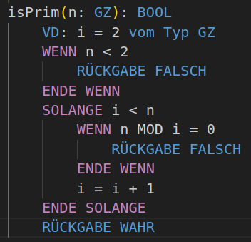

# Better PseudoCode Support

## 🎯 About

VSCode PseudoCode Support for the PseudoCode dialect used by the German school system to teach Programming.
The Language is specified in the [Formelsammlung Informationstechnik](https://www.schule-bw.de/faecher-und-schularten/berufliche-schularten/berufliches-gymnasium-oberstufe/musterpruefungsaufgaben-neue-bildungsplaene-abitur-2024/formelsammlung-it.pdf) file.

## ✨ Features

- ✅ Syntax Highlighting
- ✅ Snippets
- ❌ Linting
- ❌ Code Formatting

If you have any suggestions for new features or things like snippets that should be added feel free to open an [issue](https://github.com/Jotrorox/Better-PseudoCode-Support/issues?q=sort%3Aupdated-desc+is%3Aissue+is%3Aopen) or a [pull request](https://github.com/Jotrorox/Better-PseudoCode-Support/pulls?q=sort%3Aupdated-desc+is%3Apr+is%3Aopen).

## 💨 Getting Started

1. Launch Visual Studio Code
2. From the command palette `Ctrl-Shift-P` (Windows, Linux) or `Cmd-Shift-P` (macOS)
3. Select `Install Extension`
4. Choose the extension `PseudoCode Support`
5. Reload Visual Studio Code

Open a file with the `.pc` extension and start writing PseudoCode.

## 🙌 Contributing

Contributions are what make the open source community such an amazing place to learn, inspire, and create. Any contributions you make are **greatly appreciated**.

If you have a suggestion that would make this better, please fork the repo and create a pull request. You can also simply open an issue with the tag "enhancement".
Don't forget to give the project a star! Thanks again!

1. Fork the Project
2. Create your Feature Branch (`git checkout -b feature/AmazingFeature`)
3. Commit your Changes (`git commit -m 'Add some AmazingFeature'`)
4. Push to the Branch (`git push origin feature/AmazingFeature`)
5. Open a Pull Request

## 📝 License

This project is under the AGPLv3 License. For more details, see the [LICENSE](LICENSE) file.

 

Made with :heart: by <a href="https://jotrorox.com" target="_blank">Jotrorox</a>

&#xa0;